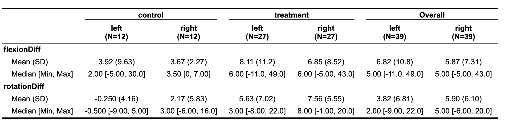
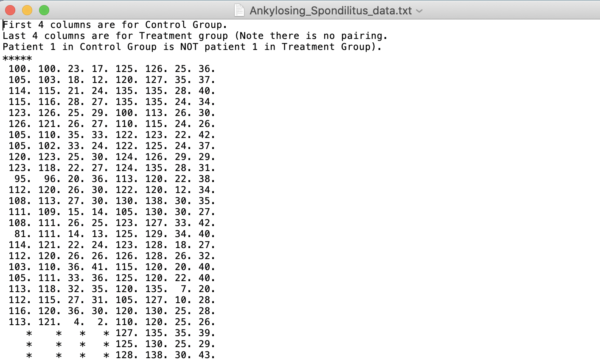

```{r Front Matter, include=FALSE}
# clean up & set default chunk options
rm(list = ls())
knitr::opts_chunk$set(echo = FALSE)

#library
library(data.table)
library(stringr)
library(readr)
library(table1)
library(ggplot2)
library(car)
library(phia)
library(ggpubr)
library(dplyr)
library(tidyr)
library(lmerTest)
library(ICC)
library(lme4)
library(Matrix)
library(lattice)

# user-defined functions

#Read in dataset
AS = read_csv("Ankylosing_Spondilitus_data_clean.csv")
```

\pagebreak

# Project Description

Royal National Hospital(RNH) for Rheumatic Diseases in Bath holds a study to test if daily stretching hip joints would help patients with Ankylosing spondylitis(AS) which is a disease that chronic form of arthritis limiting the motion of the spine and muscles can perform at a wider angle in their hip joints. 

RNH conducted three weeks long randomized testing in which thirty-nine consecutive admitted patients who have “typical” AS were randomly allocated to a control group and a treatment group. The control group received the standard treatement and the treatment group received additional stretching exerices. Patients were twice as likely to be allocated to the treatment group. As the result, The number of patients in the treatment group is twenty-seven and the number of patients in the control group is twelve. This study only concerned flexion and rotation of hips as measurements in degrees and an increase represent an improvement.

Client provided raw data from the experiment(see Appendix A for raw data set description) and wanted us to analyze the data to determine if stretch will help AS patients to get more movement in hip joints, i.e are stretch both improve flexion and rotation or only on a single measurement. We selected analyzable variables from the raw data and recorded the difference between the before stretch and after stretch test results for analysis.

## Research Questions

**Question 1:** Does additional stretch help patients improve significantly on movement in their hip joints?

**Question 2:** Does additional stretch only improve specific measurements?

## Statistical Questions 

**Question 1:** Does treatement group has significant impact on patients' hip movement improvement?

**Question 2:** Does treatement group only impact specific measurements?

**Question 3:** Is there an interaction between left and right hip of patients?


## Variables of Interested  

We subtracted the before-stretch test score from the after-stretch test score to obtain the difference between the patients’ pre and post-daily stretch movement degree test scores.

The original data provided patient ID and patients’ left/right hip separately which both can be regarded as a single unit. For accuracy, we would do different models for those two units separately to see if the conclusions are the same.

Our response variable woudl be the score difference between after-stretch and before-stretch to examine the degree of movement for every patient or every hip. Our potential explanatory variables would be treatment (control/treatment), hip(left/right), patientID with intercept of 1 as random effect variables.

In order to avoid the risk of losing information from our data, we examined data following the original data structure, using each hip as an unique identifier. Therefore, our dataset contains information for 78 hips from 39 patients. We have 8 original variables for each hip which are hipNo, patientNo, treatment, hipRL, flexionBefore, flexionAfter, rotationBefore, rotationAfter, and 2 new calculated variables for each hip which are flexiondiff and rotationdiff.


|  Variables | Descriptions                                           | Type          | Levels                                         |
|  -----------------------  | ----------------------------------------------------------------------------------------- | ------------------ | ---------------------------------------------- |
|  hipNo           | Identity of each hip                                      | Numerical   | 1 - 78 |  
   |
|  patientNo       | Identity of each patient                                  | Numerical   | 1 - 39 |
   |
|  treatment       | Control of Treatment Group indicator                      | Categorical | control, treatment|
   |
|  flexionBefore   | Flexion in degrees BEFORE treatment                       | Numerical   | 77 - 135 |                         
  |
|  flexionAfter    | Flexion in degrees AFTER treatment                        | Numerical   | 88 - 139 |                         
  |
|  rotationBefore  | Rotation in degrees BEFORE treatment                      | Numerical   | 2 - 48 |                           
  |
|  rotationAfter   | Rotation in degrees AFTER treatment                       | Numerical   | 2 - 50  |                          
  |
|  flexionDiff     | The differences of flexion pre and post treatment.        | Numerical   | -11 - 49 |                           |
  |
|  rotationDiff    | The differences of rotation pre and post treatment.       | Numerical   | -9 - 22 |                            |


\pagebreak

# Exploratory Data Analysis (EDA)

```{r Data Preprocessing, include=FALSE, warning=FALSE, message=FALSE}
# data preprocessing
AS2 = AS
AS2$flexionDiff = AS2$flexionAfter - AS2$flexionBefore
AS2$rotationDiff = AS2$rotationAfter - AS2$rotationBefore
```

```{r Data Check, include=FALSE, warning=FALSE, message=FALSE}
# Check missing value
sum(is.na(AS2))
# Check if there are situation one increase while the other decrease
AS2$BothInc<-ifelse(AS2$flexionDiff<0 & AS2$rotationDiff>0, FALSE,
                    ifelse(AS2$flexionDiff>0 & AS2$rotationDiff<0, FALSE, TRUE))
summary(AS2$BothInc)
```
 
Our data were reviewed and pre-processed prior to the statistical analysis (See Appendix B for raw dataset analysis and pre-processing producers). There were no missing values in our dataset. From raw dataset exploration, we noticed that there are 16 hips that have one measurement increase while the other decrease. For example, when one hip has improvement on flexion, this hip has negative improvement on rotation. Thus, it raised research question 2 "Does stretch only improve specific measurement" to us to get more specific insights on which measurement has been improved or both of them has been improved.  

Our main goal in this research is to focus on whether additional stretching will improve AS patients’ movement degrees. To gain more understanding on our data, first of all, we would like to know the boxplot distribution of each group's difference for each hips. 

```{r boxplotflexion, fig.align='center', fig.cap="There is no significant difference between left and right hip. There is a slightly improvement between control and treatment groups on flexion."}
#box plots for flexiondiff 
ggplot(AS2, aes(x=treatment,y=flexionDiff)) +
  geom_boxplot(aes(color=hipRL)) + 
  facet_grid(.~hipRL,scales = "free_x") +
  ggtitle("Treatment vs. FlexionDiff by hipRL on Flexion")
```

\pagebreak

```{r boxplotrotation, fig.align='center', fig.cap="There is no significant difference between left and right hips, but there is a improvement between control groups and treatment groups on rotation."}
#box plots for rotationdiff
ggplot(AS2, aes(x=treatment,y=rotationDiff)) +
  geom_boxplot(aes(color=hipRL)) + 
  facet_grid(.~hipRL,scales = "free_x") +
  ggtitle("Treatment vs. RotationDiff by hipRL on Rotation")
```

From figure1 and figure2, we can’t see a significant difference between right/left hips in both groups. However, based on the plot we can clearly see there is a improvement between control and treatment groups on rotation and a slightly difference on flexion. While it seems like treatment groups have more improvement than control groups, further models need to be tested. 

Then we also looked at the correlation between left and right hips on before, after and difference data to see if they are highly correlated (See Appendix B fig2). Even though from correlation plots between left and right hips shows they are not strongly correlated in some cases, we still concluded that left and right hip are not independent cases for each patient. Every patient has two hips and one of them would be the dominate hip, two hips from one patients should not be independent from each other in our study. 

Then we looked at the descriptive summary statistics, shown in Table2. 

```{r Sum Table, echo = FALSE, message=FALSE, fig.align='center', out.width='100%'}

```

```{r table2, include=FALSE}
#summary statistics table
table1(~flexionDiff+rotationDiff | treatment*hipRL, data=AS2)
```

Table2: This table displays number of hips in each group and difference between before and after treatment scores by hipRL. There were a total of 78 valid observations in this data, 39 left hips and 39 right hips. We noticed that the variance on both flexion and rotation difference are larger in the treatment groups. Difference toward rotation is more severe than flexion. 

In Table2, in order to make the experiment more precise, we created this table that regards each hip as a unique unit. If we first look at the control group, there is no significance between left or right hips. However, it is slightly showing toward rotation, right hips improved more than left hips which are 7.56 compares to 5.63 on treatment group and 2.17 compares to -0.250 on control groups. When we look at left and right hips as a group, treatment groups get better improvement scores on both flexion and rotation tests. In addition, there is still no significant difference between right or left hips. Variability of rotation in the treatment group is larger than in the control group in generally.

In conclusion, there is no significant difference between right or left hips. Variability of rotation in the treatment group is larger than the control group. For a more straightforward comparison boxplot please see (Appendix B fig3). In addition, Left and right hips from one patients are not independent from each other. Therefore, we decided to the use Mixed Effects Model and model patientID as a random effect. We would also make ANOVA model for our data as a comparison to the Mixed Effects Model.

\pagebreak

# Statistical Analysis 

To answer the first research question, whether stretching will help improve a patient's movement for joint hips, we employed a basic two-way ANOVA method for both Flexion difference and rotation difference. In order to test if right/left have interaction with treatment, we also add this interaction as a third factor.

### Final models

Considering the model both have fixed parts such as treatment however also should take random parts such as patient number, right/left. We finally decided to use a mixed effect model. When difference in flexion as a responsible variable, treatment as fixed effect, while hip, flexionBefore and patient as random effect, we found intraclass correlation coefficient(ICC) on hip is -0.0208 which means almost nothing related with improvement scores. So we removed that and remained patient and flexionBefore they have nearly 0.6 ICC score. The model is $lmer(flexdiff \sim treatment + (1|flexionBefore) + (1|patientNo) )$ (see appendix D). Besides, we use ANOVA to compare full models which include treatment while the null model does not, and the result is the same as before, treatment should remain on the table(see appendix D). We use the same method to rotation, this we not only eliminate hip as a random effect but also eliminate rotationBefore as their ICC scores are 0.0253 and 0.087. The final model for rotation would be $lmer(rotadiff \sim treatment + (1|patinetNo))$ (see appendix D) for the ANOVA comparison, we should still include treatment as it’s p-value is smaller than 0.05 which is 0.00393.

### ANOVA MODEL for Flexion Difference
```{r aovfd}
#anova model for flexion difference
flexionModel.full = lmer(flexionDiff ~ treatment + (1|flexionBefore) + (1|patientNo), data = AS2)
flexionModel.null = lmer(flexionDiff ~  (1|flexionBefore) + (1|patientNo), data = AS2)
anova(flexionModel.full,flexionModel.null)
```

From the ANOVA test for flexionDiff model selection, the p-value of full model, which includes treatment as an explanatory variable is 0.005728. In conclusion, treatment has significant influence on the flexion difference.

### ANOVA MODEL for Rotation Difference
```{r aovrd}
#anova model for rotation difference
rotationModel.full = lmer(rotationDiff ~ treatment + (1|patientNo),data = AS2)
rotationModel.null = lmer(rotationDiff ~ (1|patientNo),data = AS2)
anova(rotationModel.full,rotationModel.null)
```

From the ANOVA test for rotationDiff model selection, the p-value of treatment is 0.003939. In conclusion, treatment has significant influence on the rotation difference.

# Recommendations 

The main research questions our client wanted to answer was “Does additional stretch help patients to get more movement in their hip joints?”

Through our analysis, not matter based on either EDA boxplot or mixed effect model, even ANOVA output shows that stretches do help patients getting more movement in their hip joints both in the control group and treatment group. Then it brought to a more specific question that if the treatment group improved significantly more than the control group. Through the results from the initial ANOVA to experiment the significant level of difference between treatment group and control group, we consider that the treatment group has a better initial setting which means those who were chosen into the treatment group perform better at the beginning of the survey. That caused the treatment group to have significant improvement. However we use several non-parametric randomness tests (see Appendix C) to test if it actually has been randomized chosen. After we test randomness, we can conclude that based on the result, the treatment group has more improvement on the movement angle of joint hips than the control group and is only affected by stretch.

The client's last question “ Does stretch has more significant influence on rotation than flexion.”

Throughout our analysis, with mixed effect model and ANOVA model, we concluded that there is no highly correlation between left or right, and rotation will get more improvement than flexion both in right hips and left hips and both in the treatment and control group. 

# Resources 

**R-Packages:**

car:
John Fox and Sanford Weisberg (2019). An {R} Companion to Applied Regression, Third Edition. Thousand Oaks CA: Sage.
URL: https://socialsciences.mcmaster.ca/jfox/Books/Companion/

data.table:
Matt Dowle and Arun Srinivasan (2020). data.table: Extension of `data.frame`. R package version 1.13.0. https://CRAN.R-project.org/package=data.table

dplyr:
Hadley Wickham, Romain François, Lionel Henry and Kirill Müller (2020). dplyr: A Grammar of Data Manipulation. R
package version 1.0.1. https://CRAN.R-project.org/package=dplyr

ggplot2:
H. Wickham. ggplot2: Elegant Graphics for Data Analysis. Springer-Verlag New York, 2016.

ggpubr:
Alboukadel Kassambara (2020). ggpubr: 'ggplot2' Based Publication Ready Plots. R package version 0.4.0. https://CRAN.R-project.org/package=ggpubr

ICC:
M.E. Wolak, D.J. Fairbairn, Y.R. Paulsen (2012) Guidelines for Estimating
Repeatability. Methods in Ecology and Evolution 3(1):129-137.

lmerTest:
Kuznetsova A, Brockhoff PB, Christensen RHB (2017). “lmerTest Package: Tests in
Linear Mixed Effects Models.” _Journal of Statistical Software_, *82*(13), 1-26.
doi: 10.18637/jss.v082.i13 (URL: https://doi.org/10.18637/jss.v082.i13).

Lme4:
Douglas Bates, Martin Maechler, Ben Bolker, Steve Walker (2015). Fitting Linear
Mixed-Effects Models Using lme4. Journal of Statistical Software, 67(1), 1-48.
doi:10.18637/jss.v067.i01.

Matrix:
Douglas Bates and Martin Maechler (2019). Matrix: Sparse and Dense Matrix
Classes and Methods. R package version 1.2-18.
https://CRAN.R-project.org/package=Matrix

phia:
Helios De Rosario-Martinez (2015). phia: Post-Hoc Interaction Analysis. R package version 0.2-1. https://CRAN.R-project.org/package=phi

readr:
Hadley Wickham, Jim Hester and Romain Francois (2018). readr: Read Rectangular Text Data. R package version 1.3.1. https://CRAN.R-project.org/package=readr

stringr:
Hadley Wickham (2019). stringr: Simple, Consistent Wrappers for Common String Operations. R package version 1.4.0. https://CRAN.R-project.org/package=stringr

table1:
Benjamin Rich (2020). table1: Tables of Descriptive Statistics in HTML. R package version 1.2. https://CRAN.R-project.org/package=table1

tidyr:
Hadley Wickham and Lionel Henry (2020). tidyr: Tidy Messy Data. R package version 1.1.1. https://CRAN.R-project.org/package=tidyr

# Additional Considerations

During the project, we noticed there are some limitations need further discussion. First of all, the raw dataset which is provided by RHN is missing lots of important variables that may be a serious confounder such as age. In general, younger age patients may improve better than the elder even if they are in both treatment groups. And usually we will assume there is an age limitation range for this clinic trial study, however as RHN did not provide, we have sufficient reason to question the autheitch of the data.

Second, the severe level of AS symptoms wasn't provided and this kind of initial situation should be given. Statistical analytic may have many uncertainties because of these missing characters. For example, a light symptom patient won’t have as much improvement as a serious symptom can get, on the other hand, an extremely awful symptom may only be healed by surgery not stretching only. Without these information provided, we can’t have a strong conclusion.

Third, RHN didn’ t mention anything about dominating hips. As we all know, humans have preferences on the right or left hand/leg. What if the hip also has a dominant one? Will it be an improvement much more than the other side? We cannot rule out dominating hip as a variable involved in our data analytic. 

*We would like to thank the thirty nine patients and Royal National Hospital for the opportunity to work on this project. We enjoyed it and hope our results could be helpful to help more Ankylosing spondylitis patients.*


# Technical Appendix  

## Appendix A: Raw Data Description

The original data set contains 78 data rows with each hip of a patient as unique identifier and 4 variables which are flexionBefore, flexionAfter, rotationBefore and rotationAfter. Then with the raw dataset, we created columns patientID, hipID, hipRL, treatment, based on the data description during the data cleaning process.

```{r raw Table, echo = FALSE, message=FALSE, fig.align='center', out.width='60%'}

```

## Appendix B: Additional Tables and Figures used for EDA

```{r fig2, fig.align='center', fig.cap="We noticed that left and right hips are more correlated on flexion compares to rotation. Left and right hips are least correlated on rotationBefore and highest correlated on flexionAfter. "}
#correlation plots
AS_left = AS2[which(AS$hipRL=='left'),]
AS_right = AS2[which(AS$hipRL=='right'),]
par(mfrow=c(2,3))
plot(AS_left$flexionBefore, AS_right$flexionBefore, main="flexion Before Correlation")
abline(0,1,col="red")
plot(AS_left$flexionAfter, AS_right$flexionAfter, main="flexion After Correlation")
abline(0,1,col="red")
plot(AS_left$flexionDiff, AS_right$flexionDiff, main="flexion Diff Correlation")
abline(0,1,col="red")

plot(AS_left$rotationBefore, AS_right$rotationBefore, main="rotation Before Correlation")
abline(0,1,col="red")
plot(AS_left$rotationAfter, AS_right$rotationAfter, main="rotation After Correlation")
abline(0,1,col="red")
plot(AS_left$rotationDiff, AS_right$rotationDiff, main="rotation Diff Correlation")
abline(0,1,col="red")
```

```{r fig3, fig.align='center', fig.cap="From the scatter plots on flexion different and rotation different, we noticed that flexion different has several significant outliers, but in general, rotation different spreads slighlys wider than flexion."}
#difference scatter plots
par(mfrow=c(1,2))
plot(AS2$flexionDiff, ylim = c(-15,55), main = "flexion difference")
abline(h=0,col="red")
plot(AS2$rotationDiff, ylim = c(-15,55), main = "rotation difference")
abline(h=0,col="red")
```
\pagebreak

## Appendix C: Linear Mixed Effect Model Assumptions and Verification

- Assumption 1: Linearity: there is a relationship between the variables, we can conclude that from the model summary in Appendix D.

- Assumption 2: Independence: Since the patients from this experiment are randomly allocated to treatment groups, we can assume the independence.

- Assumption 3: The errors, at each set of values of the predictors, are normally distributed: Through the QQ plots (see Appendix D), we can see the data follow around the straight line, which suggest the residuals are normally distributed. 

- Assumption 4: The errors, at each set of values of the predictors, have equal variance: Through the residuals v.s fitted value plot (see Appendix D), we can see the data does not have a pattern to the fitted value. We can conclude that the variance in the error terms is constant.

## Appendix D: Addition information for Modeling

### Modeling for Flexion

```{r echo=TRUE,warning=FALSE, tidy.opts=list(width.cutoff=60)}
# initial model
flexionModel1 = lmer(flexionDiff ~ treatment + (1|hipRL) + (1|flexionBefore) + (1|patientNo), 
                     data = AS2)
summary(flexionModel1)

# checking ICC for random effects
ICCbare(hipRL,flexionDiff, AS2)
ICCbare(patientNo, flexionDiff, AS2)
ICCbare(flexionBefore,flexionDiff, AS2)

# final model
flexionModel2 = lmer(flexionDiff ~ treatment + (1|flexionBefore) + (1|patientNo), data = AS2)
summary(flexionModel2)
coefficients(flexionModel2)

# residual plots
plot(flexionModel2, main = "Residuals vs. Fiitted Plot (Flexion)")
qqmath(flexionModel2, main = "QQ plot for flexion model")
```

### Modeling for Rotation

```{r,warning=FALSE,echo=TRUE, tidy.opts=list(width.cutoff=60)}
# initial model
rotationModel1 = lmer(rotationDiff ~ treatment + (1|hipRL) + (1|rotationBefore) + (1|patientNo),
                      data = AS2)
summary(rotationModel1)

# checking ICC for random effects
ICCbare(hipRL, rotationDiff, AS2)
ICCbare(rotationBefore, rotationDiff, AS2)
ICCbare(patientNo, rotationDiff, AS2)

# final model
rotationModel2 = lmer(rotationDiff ~ treatment + (1|patientNo),data = AS2)
summary(rotationModel2)
coefficients(rotationModel2)

# residual plots
plot(rotationModel2, main = "Residuals vs. Fiitted Plot (Rotation)")
qqmath(rotationModel2, main = "QQ plot for Rotation model")
```

## R Script
```{r ref.label=c('Front Matter', 'Data Preprocessing', 'Data Check', 'boxplotflexion', 'boxplotrotation', 'table2', 'fig2', 'fig3', 'aovfd', 'aovrd'), echo=TRUE, eval=FALSE, tidy.opts=list(width.cutoff=60)}
# Reprinted code chunks used previously for analysis
```

